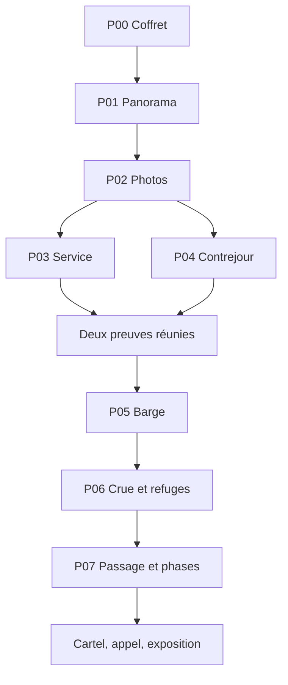

# Les Rives pliées — MASTER PLAN

Conception **1.1 verrouillée — audit du 23 septembre 2026**. Dépôt `ln549283/project_4`, branche `main`.

## État exact et prochaine tâche

**Greybox runtime T01–T11 implémenté et vérifié ; aucune production artistique finale engagée.** Le parcours P00–P07, les deux ordres P03/P04, les 21 indices, les preuves, la sauvegarde à deux générations, la navigation, N00–N11, la conclusion et la reprise d'une campagne terminée disposent d'une implémentation Godot jouable avec placeholders. Cela ne constitue toujours ni un playtest humain, ni une validation Android physique, ni une validation commerciale. La durée 60–90 minutes reste un objectif non démontré.

Vérification automatisée du 23 septembre 2026 : **Greybox CI #22 verte sur le commit `ca780ee` avec Godot 4.6.2 Standard verrouillé**. Les contrôles exécutés couvrent `verify_design.py`, contrats valides/invalides, validateurs P01–P07, progression et preuves, deux ordres de branche, sauvegardes interrompues/corrompues/futures, navigation, interactions greybox P00–P07, campagne complète N00–N11 avec sauvegarde/rechargement, parité des contrats runtime et boot headless. Les tests automatiques ne remplacent pas l'observation d'un joueur novice.

**Prochaine tâche : T12 de [PRODUCTION_PLAN.md](PRODUCTION_PLAN.md)**. Exécuter le protocole novice déjà verrouillé dans [docs/QA.md](docs/QA.md) avec 8 nouveaux joueurs, mesurer la durée active réelle et les blocages, puis produire le rapport anonymisé prévu. **Ne pas commencer T13 ni fabriquer les assets finaux tant que le gate T12 n'est pas accepté.** Si T12 échoue, appliquer uniquement les corrections ciblées prévues par le plan et versionner le dossier avant une nouvelle campagne de test.

Reprise : lire ce master, PRODUCTION_PLAN, ASSET_BIBLE et QA ; vérifier HEAD/CI et l'existence d'un rapport T12 valide. En l'absence de données humaines T12, arrêter la production avant T13. En fin de session, consigner vérifications réellement exécutées, limites et prochaine tâche ; commit/push. Aucun choix de concept à soumettre au producteur.

## Vision et invariants

**« Dépliez une ville. Retrouvez le chemin de ceux qu'elle a sauvés. »** Jeu tactile de déduction environnementale premium, Android, français, hors ligne, prix choisi 3,49 €, sans compte, publicité, achat intégré ou télémétrie. Sessions naturelles de 5–15 minutes ; première partie visée 60–90 minutes. Architecture localisable, aucune traduction promise en V1.

Sept étapes P01–P07, prise en main P00 et conclusion complète unique. P01 est l'apprentissage ; P04 une respiration active ; P07 une synthèse. P02, P03, P05 et P06 portent l'essentiel de la déduction. Ne pas compter le nombre de permutations comme mesure d'intérêt.

Invariants : aucune connaissance obscure ; toute preuve disponible avant usage et conservée ; trois indices maximum par énigme, dernier indice méthodologique sans solution ; pas de chrono réel, mort punitive, consommable ou pixel hunting ; gestes réalisables par toucher puis toucher ; toutes les solutions conformes admises ; couleur et son jamais seuls porteurs d'information ; aucune narration obligatoire supérieure à 65 mots par panneau. Les scènes narratives sont interruptibles et relisibles. Pas de carte ajoutée pour allonger artificiellement la durée.

## Autorité documentaire

| Document | Autorité |
|---|---|
| Ce master | Vision, périmètre V1, état et reprise |
| [PRODUCTION_PLAN.md](PRODUCTION_PLAN.md) | Tâches, dépendances et critères de livraison |
| [ASSET_BIBLE.md](ASSET_BIBLE.md) | Direction artistique, formats, catégories et inventaire exhaustif |
| [docs/PUZZLES.md](docs/PUZZLES.md) | Toutes les règles, solutions, manipulations, erreurs et 21 indices |
| [design/puzzles.json](design/puzzles.json) | Données numériques/topologie canoniques |
| [design/evidence.json](design/evidence.json) | Acquisition et disponibilité des preuves |
| [design/hints_fr.json](design/hints_fr.json) | Texte des 21 indices P01–P07 ; P00 sans indice |
| [docs/NARRATIVE.md](docs/NARRATIVE.md) | Scénario complet, dialogues, pièces à conviction |
| [docs/SCREENS_UX.md](docs/SCREENS_UX.md) | Écrans, navigation, interactions/accessibilité |
| [docs/TECHNICAL.md](docs/TECHNICAL.md) | Modules, sauvegarde, conventions/build |
| [docs/ART_AUDIO.md](docs/ART_AUDIO.md) | Son et animations |
| [design/assets.csv](design/assets.csv) | Manifest lisible machine, mêmes entrées que la bible |
| [docs/AUDIT.md](docs/AUDIT.md) et [docs/WALKTHROUGH.md](docs/WALKTHROUGH.md) | Faiblesses, corrections, simulation novice et limites |
| [docs/QA.md](docs/QA.md) | Gates de qualité, contrôles réels et contrôles à faire |
| [docs/DECISIONS.md](docs/DECISIONS.md) | Décisions verrouillées et procédure de changement |

Les annexes forment le contrat détaillé du master. Toute modification numérique synchronise JSON, texte, planches et tests. Ne jamais appliquer une ancienne version 1.0 à côté de la 1.1. Les mentions historiques dans AUDIT/DECISIONS ne sont pas des fonctionnalités à réaliser.

## Univers, personnages, histoire complète

Orme-sur-Rive, commune fluviale fictive sans date historique revendiquée. Douze ans après une crue d'automne, Nelle, restauratrice de papier de 29 ans, prépare au printemps une exposition dans **la salle municipale de restauration**. Ce n'est pas l'ancien atelier, qui n'a pas été reconstruit. Aline, sa mère cartonniste, vit ailleurs et a volontairement fourni sa maquette, ses photographies et son témoignage. Jo conserve ce fonds. Le sauvetage et la survie des habitants sont connus dès l'ouverture ; le problème est d'expliquer matériellement son déroulement.

Le cartel provisoire juxtapose atelier démonté et évacuation mal documentée. Il n'accuse personne : pas de complot, procès, témoignage caché ou mère qui refuse de parler. Nelle ouvre le coffret, répare le panorama, puis classe cinq photographies par les transformations irréversibles du paysage. Elle reconstitue les livraisons et identifie une structure construite dans un contrejour. Elle stabilise une cargaison possible avant déchargement ; la petite presse est ensuite gardée comme ballast central, les amarres et guides assurant le maintien de la barge.

Le grand plan confronte niveau d'eau, passages noyés, marches et fragments de maçonnerie : trois groupes atteignent les refuges. Le groupe de l'école arrive au clocher, pas encore au quai haut. La dernière interruption correspond au plancher de l'atelier, identifié par profil, largeur et attaches. Nelle le déplace dans la maquette puis reconstitue six phases de l'opération. Le témoignage déjà accessible accompagne les photographies ; la réussite du modèle ne prouve pas seule l'histoire.

Nelle remplace le cartel par un récit factuel, appelle Aline (« J'ai compris le plancher. » / « Il était fait pour porter du monde. ») et lui présente la maquette exposée. L'atelier n'est pas magiquement restauré. Fin unique résolue, générique, exploration des preuves et scènes terminées en lecture seule, ou nouvelle partie confirmée.

## Déroulé et rythme

Budgets ci-dessous : hypothèses de conception, non des mesures. Leur somme **42–70 minutes** expose un écart avec la cible commerciale 60–90 ; ce risque est bloquant pour une promesse de durée. Pas de texte ou d'attente ajouté pour le masquer. T12 mesure le parcours complet avant la fabrication massive des assets.

| Séquence | Action, preuve et objectif suivant | Budget hypothétique |
|---|---|---:|
| Arrivée + P00 | Cartel, coffret à deux attaches, ouvrir la maquette | 2–3 min |
| P01 | Cinq lés ; lieux identifiables ; photos, note et témoignage acquis | 2–4 min |
| R1 | Survie confirmée ; consulter/ordonner les photos | 1–2 min |
| P02 | Cinq instants par dommages irréversibles | 5–9 min |
| P03 | Trois livraisons simultanées dans six volets | 5–9 min |
| P04 | Trois calques ; silhouette des appuis, respiration active | 1–3 min |
| R2 | Deux preuves réunies ; charger la barge | 1–2 min |
| P05 | Équilibre, masses/distances et gabarits ; grand plan acquis | 6–10 min |
| P06 | Eau observée, deux fragments, trois itinéraires | 10–16 min |
| R3 | Dernière interruption clocher/quai et détail de photo | 1–2 min |
| P07 | Reconnaître une pièce puis classer six opérations | 5–7 min |
| Conclusion | Cartel, appel, exposition et générique | 3–3 min |

Total corrigé : **42–70 min**. P03 et P04 possibles dans les deux ordres ; le rythme exact de cette branche dépend du choix du joueur. Les respirations sont des observations interactives brèves, jamais des attentes obligatoires.

## Graphe de progression

`solved` est monotone ; P03/P04 ne réinitialisent jamais l'autre. Preuves attribuées sur prérequis, pas sur lecture d'un dialogue. Tous les brouillons restent modifiables avant validation. Chaque vue propose un objectif concret et un accès au prochain travail disponible ; jamais de recherche d'un hotspot caché.

## Toutes les solutions

| Étape | Contrat résumé et solution | Sortie |
|---|---|---|
| P00 | Deux attaches puis languette ; apprentissage, aucune combinaison | P01 |
| P01 | Cinq raccords à double signature : L3,L1,L5,L2,L4 | Photos et témoignage |
| P02 | Dommages irréversibles : F4,F1,F5,F2,F3 | P03/P04 |
| P03 | 2×3 volets, ports/couples dans JSON : faces 1,1,1 / 0,0,0 | Plan de service |
| P04 | Union exacte de trois masques 7×7 : rotations 0,0,0 depuis 1,2,3 | Structure à quatre appuis |
| P05 | Six masses 1–6 aux distances −3,−2,−1,+1,+2,+3 ; presse/lanterne centrales ; moment nul | Quatre solutions ci-dessous |
| P06 | Eau4, arcade J–K, rampe K–L ; école S–J–K–C ; brancard I–J–K–L–H ; archives A–J–K–L–G ou A–J–K–H–L–G | Clocher et dernière interruption |
| P07A | Tous candidats longueur3 ; seul plancher plat, largeur2 et attaches appariées | Passage |
| P07B | Livrer, relever l'escalier, déposer le plancher, étayer, faire passer, détacher | Conclusion |

P05 gauche→droite : médicaments/outils/presse/lanterne/teintures/vivres ; vivres/teintures/lanterne/presse/outils/médicaments ; outils/médicaments/presse/lanterne/vivres/teintures ; teintures/vivres/lanterne/presse/médicaments/outils. Toutes acceptées. Aucune contrainte de voisinage.

P06 : S école, I infirmerie, A archives, J place, K terrasse, L cour haute, C clocher, H halle haute, G grenier. Seul raccourci I–H noyé au niveau4. Marches interdites au brancard ; refuges et nœuds toujours secs. Fragments de carte représentant de la maçonnerie, jamais des planches réutilisables en P07. Toutes les arêtes, seuils et variantes sont dans PUZZLES/JSON.

## Écrans, objets et production visuelle

Un seul espace présent : salle de restauration/établi. Archives et fenêtre sont des vues rapprochées directes, pas trois pièces à explorer. S00 accueil, S01 réglages, S02 établi, S03 archives, S04 fenêtre, S05–S11 P01–P07, S12 carnet, S13 conclusion, S14 générique/exploration. Overlays pause, indices, confirmation, fonctionnement, sauvegarde, image agrandie. SCREENS_UX donne chaque transition et état.

Objets : deux attaches et coffret, cinq lés, cinq photos, trois calques, fiche de livraison, six charges, deux fragments de carte, trois groupes, trois candidats rigides, six cartes d'action, coupe de crue, témoignage et cartel. Pas d'inventaire générique ni de combinaison d'objet sur tout.

DA : carton découpé, papier ivoire, graphite bleu nuit, vert de rivière, cuivre patiné ; précision géométrique sur les preuves. Son matériel doux, deux compositions, trois ambiances, aucune voix enregistrée. ASSET_BIBLE et CSV énumèrent chaque fichier requis, dérivé ou exclu ; tous sont encore à produire. Les SVG de `design/plates` sont des schémas techniques révélant les solutions, pas des assets du jeu.

## Architecture, sauvegarde et conventions

Godot 4.6.2 Standard/GDScript typé, Compatibility 2D, portrait 1080×1920, Android 10+ arm64. Pas de backend. GameState, Progression, SaveService, SceneRouter, AudioService ; validateurs purs distincts, le rendu ne décide pas d'une solution. JSON canoniques importés, clés de traduction séparées, chemins ASCII snake_case, identifiants immuables, coordonnées zéro-indexées.

Deux générations de sauvegarde validées par schéma/hash et cohérence de génération ; snapshot après geste stable, jamais données Node. Résolution, attribution de preuves et file narrative dans la même transaction. `completed` après conclusion acquittée. Reprise d'animation sur état stable ; fichier plus récent inconnu conservé sans écriture. Aucun export diagnostic/partage système en V1.

Toucher/sélectionner partout, cibles48 dp avec8 dp de séparation ; commandes alternatives pour cartes denses. Texte100/125/150%, mouvement réduit, contraste renforcé, motifs et labels indépendants de la couleur, volumes réglables. Sauvegarde à chaque action stable ; annuler local et remise à zéro du puzzle non résolu avec confirmation. Lecteur d'écran complet non revendiqué avant vérification spécifique.

## V1 obligatoire / à ignorer

Obligatoire : parcours intégral, fin, 21 indices, preuves permanentes, deux ordres de branche, toutes solutions admises, sauvegarde robuste, accessibilité décrite, assets marqués required_v1, mix sans son indispensable, crédits/licences, APK testé puis AAB signé et préparation store. Mesure novice de durée/qualité obligatoire avant déclaration commerciale.

À ignorer : replay sandbox par chapitre, trois salles navigables, seconde grille de tuyaux, fausses cartes finales, règle médicaments/teintures, export diagnostic système, cloud, compte, succès, chrono, niveaux bonus, voix enregistrées, langues autres que FR, éclairage dynamique, changement automatique de fréquence, assets ignore_v1. Ne pas les développer par anticipation.

## Limites de verrouillage

Les décisions créatives actuelles sont fixées. La durée et le confort restent des hypothèses empiriques. Si T12 échoue, suspendre la production coûteuse, consigner les données et réviser de façon ciblée ce dossier ; ne pas réduire silencieusement la promesse à un produit plus court ni remplir avec des mini-jeux. Aucun dossier papier ne peut honnêtement garantir à lui seul 60–90 minutes de plaisir.
