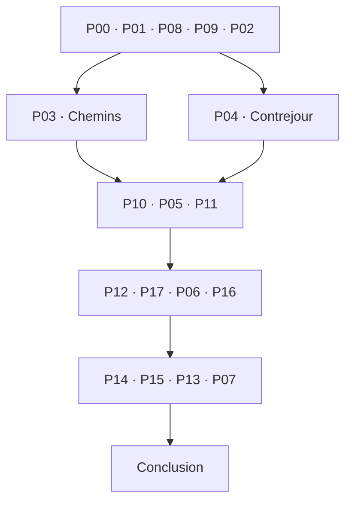

# Les Rives pliées — MASTER PLAN

Conception **1.2 — extension autorisée de dix énigmes**. Dépôt `ln549283/project_4`, branche `main`.

## État exact et prochaine tâche

**Campagne greybox étendue à 17 énigmes, plus P00.** Dix nouveaux plateaux P08–P17, 30 indices supplémentaires (51 au total), progression intégrée, objectifs, preuves, textes et sauvegardes sont implémentés. Les sept énigmes d'origine conservent leurs règles. Les ajouts ne sont pas des assets finaux.

Retour producteur : les énigmes existantes prennent environ **35–40 minutes**. C'est une observation communiquée, sans protocole ni taille d'échantillon documentés. La durée finale de la version étendue n'est pas encore mesurée. Les vérifications reproductibles sont décrites dans QA et EXPANSION_1_2.

**Prochaine tâche : T12 sur la campagne 1.2**, observation novice de l'ensemble, durée par étape, compréhension visuelle et rythme. Ne pas passer à la production artistique massive avant validation. Le moteur reste Godot ; aucune migration demandée ni effectuée.

Reprise : MASTER, EXPANSION_1_2, PRODUCTION_PLAN, ASSET_BIBLE, contrats JSON. Les IDs sont stables mais leur ordre n'est plus numérique. Les sauvegardes 1.1 sont conservées et migrées ; les dix nouveautés restent à jouer.

## Vision et invariants

**« Dépliez une ville. Retrouvez le chemin de ceux qu'elle a sauvés. »** Jeu tactile de déduction environnementale premium, Android, français, hors ligne, prix choisi 3,49 €, sans compte, publicité, achat intégré ou télémétrie. Sessions naturelles de 5–15 minutes ; première partie visée 60–90 minutes. Architecture localisable, aucune traduction promise en V1.

Dix-sept énigmes P01–P17, prise en main P00 et conclusion complète unique. P01 est l'apprentissage ; P04 une respiration active ; P07 une synthèse. P02, P03, P05 et P06 portent l'essentiel de la déduction. Ne pas compter le nombre de permutations comme mesure d'intérêt.

Invariants : aucune connaissance obscure ; toute preuve disponible avant usage et conservée ; trois indices maximum par énigme, dernier indice méthodologique sans solution ; pas de chrono réel, mort punitive, consommable ou pixel hunting ; gestes réalisables par toucher puis toucher ; toutes les solutions conformes admises ; couleur et son jamais seuls porteurs d'information ; aucune narration obligatoire supérieure à 65 mots par panneau. Les scènes narratives sont interruptibles et relisibles. Pas de carte ajoutée pour allonger artificiellement la durée.

## Autorité documentaire

| Document | Autorité |
|---|---|
| [docs/EXPANSION_1_2.md](docs/EXPANSION_1_2.md) | Dix ajouts, règles, solutions, rythme et migration 1.2 |
| Ce master | Vision, périmètre V1, état et reprise |
| [PRODUCTION_PLAN.md](PRODUCTION_PLAN.md) | Tâches, dépendances et critères de livraison |
| [ASSET_BIBLE.md](ASSET_BIBLE.md) | Direction artistique, formats, catégories et inventaire exhaustif |
| [docs/PUZZLES.md](docs/PUZZLES.md) | Toutes les règles, solutions, manipulations, erreurs et 51 indices |
| [design/puzzles.json](design/puzzles.json) | Données numériques/topologie canoniques |
| [design/evidence.json](design/evidence.json) | Acquisition et disponibilité des preuves |
| [design/hints_fr.json](design/hints_fr.json) | Texte des 51 indices P01–P17 ; P00 sans indice |
| [docs/NARRATIVE.md](docs/NARRATIVE.md) | Scénario complet, dialogues, pièces à conviction |
| [docs/SCREENS_UX.md](docs/SCREENS_UX.md) | Écrans, navigation, interactions/accessibilité |
| [docs/TECHNICAL.md](docs/TECHNICAL.md) | Modules, sauvegarde, conventions/build |
| [docs/ART_AUDIO.md](docs/ART_AUDIO.md) | Son et animations |
| [design/assets.csv](design/assets.csv) | Manifest lisible machine, mêmes entrées que la bible |
| [docs/AUDIT.md](docs/AUDIT.md) et [docs/WALKTHROUGH.md](docs/WALKTHROUGH.md) | Faiblesses, corrections, simulation novice et limites |
| [docs/QA.md](docs/QA.md) | Gates de qualité, contrôles réels et contrôles à faire |
| [docs/DECISIONS.md](docs/DECISIONS.md) | Décisions verrouillées et procédure de changement |

Les annexes forment le contrat détaillé du master. Toute modification numérique synchronise JSON, texte, planches et tests. Ne jamais appliquer une ancienne version 1.0 ou 1.1 à côté de la 1.2. Les mentions historiques dans AUDIT/DECISIONS ne sont pas des fonctionnalités à réaliser.

## Univers, personnages, histoire complète

Orme-sur-Rive, commune fluviale fictive sans date historique revendiquée. Douze ans après une crue d'automne, Nelle, restauratrice de papier de 29 ans, prépare au printemps une exposition dans **la salle municipale de restauration**. Ce n'est pas l'ancien atelier, qui n'a pas été reconstruit. Aline, sa mère cartonniste, vit ailleurs et a volontairement fourni sa maquette, ses photographies et son témoignage. Jo conserve ce fonds. Le sauvetage et la survie des habitants sont connus dès l'ouverture ; le problème est d'expliquer matériellement son déroulement.

Le cartel provisoire juxtapose atelier démonté et évacuation mal documentée. Il n'accuse personne : pas de complot, procès, témoignage caché ou mère qui refuse de parler. Nelle ouvre le coffret, répare le panorama, puis classe cinq photographies par les transformations irréversibles du paysage. Elle reconstitue les livraisons et identifie une structure construite dans un contrejour. Elle stabilise une cargaison possible avant déchargement ; la petite presse est ensuite gardée comme ballast central, les amarres et guides assurant le maintien de la barge.

Le grand plan confronte niveau d'eau, passages noyés, marches et fragments de maçonnerie : trois groupes atteignent les refuges. Le groupe de l'école arrive au clocher, pas encore au quai haut. La dernière interruption correspond au plancher de l'atelier, identifié par profil, largeur et attaches. Nelle le déplace dans la maquette puis reconstitue six phases de l'opération. Le témoignage déjà accessible accompagne les photographies ; la réussite du modèle ne prouve pas seule l'histoire.

Nelle remplace le cartel par un récit factuel, appelle Aline (« J'ai compris le plancher. » / « Il était fait pour porter du monde. ») et lui présente la maquette exposée. L'atelier n'est pas magiquement restauré. Fin unique résolue, générique, exploration des preuves et scènes terminées en lecture seule, ou nouvelle partie confirmée.

## Déroulé et rythme

## Ordre canonique

P00 → P01 → P08 → P09 → P02 → [P03 ∥ P04] → P10 → P05 → P11 → P12 → P17 → P06 → P16 → P14 → P15 → P13 → P07 → conclusion

P03 et P04 restent les deux seules étapes interchangeables. Toutes les nouvelles énigmes font partie de la campagne. Aucun puzzle ajouté après l'épilogue. Aucun compteur, temps d'attente ou texte ajouté pour gonfler la durée.

## Courbe de rythme

| Acte | Séquences | Fonction et respiration |
|---|---|---|
| I — Retrouver le lieu | P00, P01, P08, P09, P02 | Entrée tactile douce, repérage spatial, obstacle mécanique, première déduction temporelle. N01 et la découverte du tiroir laissent respirer. |
| II — Préparer les secours | P03/P04, P10, P05, P11 | Branche libre ; contrejour court ; rangement spatial puis balance ; les amarres terminent l'acte par un geste visuel. |
| III — Accueillir et rejoindre | P12, P17, P06, P16 | Partage de l'eau, calibration courte, grand plan central, planification des navettes. Pas de chronomètre ni conséquence punitive. |
| IV — Comprendre le passage | P14, P15, P13, P07, conclusion | Pliage, appuis brefs, lumière ; trois gestes concrets préparent la synthèse finale. Aucun nouveau système après P07. |

Les difficultés dominantes ajoutées sont P09/P10/P12/P16. P15 est délibérément court : il ne doit pas être vendu comme une grosse énigme. Les animations narratives restent sautables, les objectifs visibles, les pauses libres et les brouillons sauvegardés après chaque geste stable.

## Durée

Base rapportée : 35–40 minutes d'énigmes. Ajouts : 26–40 minutes estimées, donc 61–80 minutes d'énigmes avant ouverture et conclusion. Cible totale 60–90 minutes à mesurer ; aucune garantie issue d'une addition de budgets.

## Graphe de progression

Chaque groupe est séquentiel dans l'ordre affiché. Le graphe exact par étape est `design/puzzles.json.progression`. Les preuves sont attribuées sur prérequis, jamais sur lecture obligatoire. Pas de chrono, mort, pénalité ou irréversibilité nouvelle.

## Solutions P01–P07 conservées

| Étape | Contrat résumé et solution | Sortie |
|---|---|---|
| P00 | Deux attaches puis languette ; apprentissage, aucune combinaison | P01 |
| P01 | Cinq raccords à double signature : L3,L1,L5,L2,L4 | Photos et témoignage |
| P02 | Dommages irréversibles : F4,F1,F5,F2,F3 | P03/P04 |
| P03 | 2×3 volets, ports/couples dans JSON : faces 1,1,1 / 0,0,0 | Plan de service |
| P04 | Union exacte de trois masques 7×7 : rotations 0,0,0 depuis 1,2,3 | Structure à quatre appuis |
| P05 | Six masses 1–6 aux distances −3,−2,−1,+1,+2,+3 ; presse/lanterne centrales ; moment nul | Quatre solutions ci-dessous |
| P06 | Eau4, arcade J–K, rampe K–L ; école S–J–K–C ; brancard I–J–K–L–H ; archives A–J–K–L–G ou A–J–K–H–L–G | Clocher et dernière interruption |
| P07A | Tous candidats longueur3 ; seul plancher plat, largeur2 et attaches appariées | Passage |
| P07B | Livrer, relever l'escalier, déposer le plancher, étayer, faire passer, détacher | Conclusion |

P05 gauche→droite : médicaments/outils/presse/lanterne/teintures/vivres ; vivres/teintures/lanterne/presse/outils/médicaments ; outils/médicaments/presse/lanterne/vivres/teintures ; teintures/vivres/lanterne/presse/médicaments/outils. Toutes acceptées. Aucune contrainte de voisinage.

P06 : S école, I infirmerie, A archives, J place, K terrasse, L cour haute, C clocher, H halle haute, G grenier. Seul raccourci I–H noyé au niveau4. Marches interdites au brancard ; refuges et nœuds toujours secs. Fragments de carte représentant de la maçonnerie, jamais des planches réutilisables en P07. Toutes les arêtes, seuils et variantes sont dans PUZZLES/JSON.

## Solutions P08–P17

Voir [EXPANSION_1_2.md](docs/EXPANSION_1_2.md) pour les dix règles, solutions exactes, variantes, trente indices et témoins de gestes légaux. `design/expansion_verification.json` consigne les résultats indépendants.

## Écrans, objets et production visuelle

Un seul espace présent : salle de restauration/établi. Archives et fenêtre sont des vues rapprochées directes, pas trois pièces à explorer. S00 accueil, S01 réglages, S02 établi, S03 archives, S04 fenêtre, S05–S11 P01–P07, S12 carnet, S13 conclusion, S14 générique/exploration. Overlays pause, indices, confirmation, fonctionnement, sauvegarde, image agrandie. Dix vues additionnelles portent les routes p08–p17 et réutilisent le cadre d’établi. SCREENS_UX et EXPANSION_1_2 donnent les transitions et états.

Objets : deux attaches et coffret, cinq lés, cinq photos, trois calques, fiche de livraison, six charges, deux fragments de carte, trois groupes, trois candidats rigides, six cartes d'action, coupe de crue, témoignage et cartel. Pas d'inventaire générique ni de combinaison d'objet sur tout.

DA : carton découpé, papier ivoire, graphite bleu nuit, vert de rivière, cuivre patiné ; précision géométrique sur les preuves. Son matériel doux, deux compositions, trois ambiances, aucune voix enregistrée. ASSET_BIBLE et CSV énumèrent chaque fichier requis, dérivé ou exclu ; tous sont encore à produire. Les SVG de `design/plates` sont des schémas techniques révélant les solutions, pas des assets du jeu.

## Architecture, sauvegarde et conventions

Godot 4.6.2 Standard/GDScript typé, Compatibility 2D, portrait 1080×1920, Android 10+ arm64. Pas de backend. GameState, Progression, SaveService, SceneRouter, AudioService ; validateurs purs distincts, le rendu ne décide pas d'une solution. JSON canoniques importés, clés de traduction séparées, chemins ASCII snake_case, identifiants immuables, coordonnées zéro-indexées.

Deux générations de sauvegarde validées par schéma/hash et cohérence de génération ; snapshot après geste stable, jamais données Node. Résolution, attribution de preuves et file narrative dans la même transaction. `completed` après conclusion acquittée. Reprise d'animation sur état stable ; fichier plus récent inconnu conservé sans écriture. Aucun export diagnostic/partage système en V1.

Toucher/sélectionner partout, cibles48 dp avec8 dp de séparation ; commandes alternatives pour cartes denses. Texte100/125/150%, mouvement réduit, contraste renforcé, motifs et labels indépendants de la couleur, volumes réglables. Sauvegarde à chaque action stable ; annuler local et remise à zéro du puzzle non résolu avec confirmation. Lecteur d'écran complet non revendiqué avant vérification spécifique.

## V1 obligatoire / à ignorer

Obligatoire : parcours intégral, fin, 51 indices, preuves permanentes, deux ordres de branche, toutes solutions admises, sauvegarde robuste, accessibilité décrite, assets marqués required_v1, mix sans son indispensable, crédits/licences, APK testé puis AAB signé et préparation store. Mesure novice de durée/qualité obligatoire avant déclaration commerciale.

À ignorer : replay sandbox par chapitre, trois salles navigables, seconde grille de tuyaux, fausses cartes finales, règle médicaments/teintures, export diagnostic système, cloud, compte, succès, chrono, niveaux bonus, voix enregistrées, langues autres que FR, éclairage dynamique, changement automatique de fréquence, assets ignore_v1. Ne pas les développer par anticipation.

## Limites de verrouillage

La demande producteur a autorisé l’extension 1.2 ; les dix ajouts sont désormais spécifiés. Les décisions créatives actuelles sont fixées. La durée et le confort restent des hypothèses empiriques. Si T12 échoue, suspendre la production coûteuse, consigner les données et réviser de façon ciblée ce dossier ; ne pas réduire silencieusement la promesse à un produit plus court ni remplir avec des mini-jeux. Aucun dossier papier ne peut honnêtement garantir à lui seul 60–90 minutes de plaisir.
