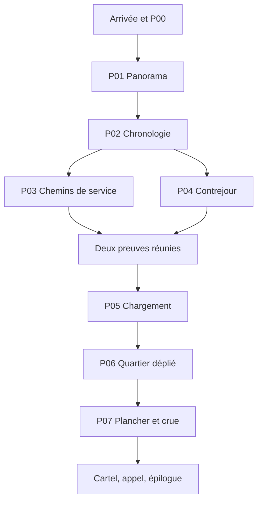

# LES RIVES PLIÉES — MASTER PLAN

Version de conception : 1.0 · 22 septembre 2026 · propriétaire produit : Nibylo Games.
Dépôt : `ln549283/project_4` · branche de référence : `main`.

## 0. État exact et reprise

**CONCEPTION TERMINÉE ; PRODUCTION NON COMMENCÉE.** Ce dépôt contient le contrat de conception, les données des énigmes et leur vérificateur, pas encore un jeu jouable. Les solutions combinatoires ont été vérifiées ; l'intérêt tactile, la lisibilité et la durée restent à valider sur une version jouable avec des joueurs novices. Ne pas présenter ces contrôles comme des playtests.

**Prochaine tâche précise :** suivre `docs/PRODUCTION.md`, lot PROD-01 : créer le projet Godot 4.6.2 Standard/GDScript, renderer Compatibility, viewport portrait 1080×1920 ; implémenter le magasin d'état, la sauvegarde à deux générations et le contrôleur de panneaux de P03 à partir de `design/puzzles.json`. Obtenir une scène P03 manipulable avec les trois parcours, annulation et reprise après fermeture. Cette étape interne doit être immédiatement suivie de la production de l'ensemble du jeu ; elle n'est pas le livrable final demandé.

Ordre de lecture à chaque nouvelle session : ce fichier → `docs/PRODUCTION.md` → document du lot concerné → `docs/QA.md`. Avant de modifier : vérifier le HEAD distant, les changements locaux et les nouvelles consignes. À la fin : mettre à jour état, journal, tâche suivante et tests réellement effectués, puis commit/push. Aucun choix de concept n'est laissé au producteur.

## 1. Vision et décision

**Promesse : « Dépliez une ville. Retrouvez le chemin de ceux qu'elle a sauvés. »**

Un jeu tactile de déduction environnementale, composé comme un livre animé haut de gamme. Dans un ancien atelier de cartonnage, Nelle restaure une maquette de prévention des crues construite par sa mère Aline. Un rapport accuse Aline d'avoir démonté son atelier au mauvais moment, aggravant les dégâts. Les images, les objets et les chemins reconstitués montrent progressivement l'inverse : son plancher est devenu la passerelle qui a permis l'évacuation de l'école.

Le joueur ne lit pas simplement cette histoire : il raccorde les trajets, remet les images en ordre, superpose des ombres, équilibre une cargaison et rejoue l'opération. L'atelier initialement traité comme un lieu à préserver devient la matière du sauvetage final. Aline est vivante ; pas de mort surprise, pas de surnaturel, pas de téléphone trouvé, pas de boucle temporelle.

Titre retenu : **Les Rives pliées**. Identifiant interne durable : `folded_shores`. Le titre commercial devra faire l'objet d'une vérification de disponibilité avant publication ; aucune disponibilité juridique n'est affirmée par ce dossier.

Produit : achat unique, prix de lancement choisi **3,49 €**, Android d'abord, intégralement hors ligne, sans publicité, compte, collecte comportementale ni achat intégré. Français intégral en v1 ; architecture localisable, traduction anglaise après validation française et avant toute fiche annonçant cette langue. Pas de backend. Durée cible d'une première découverte : **60–90 minutes**, budget de conception central 70 minutes ; pas une durée mesurée. Sessions naturelles de 5–15 minutes.

## 2. Règles immuables

1. Sept énigmes P01–P07, une prise en main P00, une fin unique complète. Ne pas ajouter de niveaux pour gonfler la durée.
2. L'essentiel du temps doit être consacré à observer et manipuler. Aucun pavé obligatoire de plus de 65 mots ; aucune cinématique non interactive de plus de 35 secondes.
3. Tout renseignement nécessaire existe à l'écran ou dans un document consultable et épinglable. Pas de culture générale, calcul mental obligatoire, code caché hors jeu ou pixel hunting.
4. Trois indices **maximum par énigme**, textuels, accessibles gratuitement, persistants. Le troisième précise une méthode sans donner la combinaison ni la séquence complète.
5. Aucun chrono réel, aucune mort punitive, aucune ressource consommable, aucun échec qui détruit une sauvegarde. La crue finale est un simulateur à étapes, commandé par le joueur.
6. Toutes les solutions satisfaisant les règles sont acceptées, notamment les quatre chargements de P05. Jamais de solution secrète plus restrictive que les règles visibles.
7. La couleur, le son, le maintien tactile et les gestes rapides ne portent jamais seuls une information. Toutes les manipulations ont une alternative toucher/sélectionner.
8. La maquette est un schéma pédagogique, pas un système surnaturel ni une simulation d'ingénierie. Les chemins imprimés sont des trajets possibles ; retourner un volet choisit une organisation, cela ne déplace pas réellement les maisons de la ville.
9. Le rapport contesté, le rôle du plancher et la responsabilité d'Aline doivent être prouvés par plusieurs éléments indépendants. Une maquette réussie ne prouve pas seule ce qui s'est passé.
10. L'histoire personnelle se résout : Nelle corrige le cartel avec les preuves, contacte sa mère, lui remet la maquette restaurée. Aucune fin réservée à un épisode suivant.
11. Un seul langage visuel : carton découpé, encre, tissu et cuivre patiné. Aucun rendu glossy de jeu casual, aucune banque disparate d'icônes.
12. Réduire animations décoratives et vues secondaires en cas de dépassement, jamais supprimer les indices, l'épilogue, la robustesse des sauvegardes ou la vérification des puzzles.

## 3. Documents et autorité

| Fichier | Contenu normatif |
|---|---|
| `MASTER_PLAN.md` | Vision, périmètre, état, progression, contrats résumés, reprise |
| `docs/PUZZLES.md` | Règles exactes, solutions expliquées, trois indices, erreurs, walkthrough novice |
| `design/hints_fr.json` | Les 24 aides françaises (3 par étape P00–P07) |
| `design/puzzles.json` | Données numériques et topologiques canoniques ; consommées par le vérificateur puis le jeu |
| `docs/NARRATIVE.md` | Histoire complète, scènes, tous les textes narratifs et pièces à conviction |
| `docs/SCREENS_UX.md` | Inventaire complet, navigation, interactions, états, accessibilité |
| `docs/ART_AUDIO.md` | DA, composition, animation, son et pipeline |
| `design/assets.csv` | Assets individuels, dimensions, usage, état, production et acceptation |
| `docs/TECHNICAL.md` | Moteur, modules, sauvegarde, build, conventions |
| `docs/QA.md` | Cas de test, contrôles réalisés, risques et critères de sortie |
| `docs/PRODUCTION.md` | Lots ordonnés, critères, journal et prochain travail |
| `docs/DECISIONS.md` | Alternatives écartées, autocritique, décisions et règles de changement |
| `tools/verify_design.py` | Vérification exécutable, hors code du jeu |

Le master est la source de vérité du périmètre. Les annexes font partie de son contrat, sans variante optionnelle à choisir. Pour un détail numérique, `puzzles.json` prévaut ; toute modification exige mise à jour synchronisée du texte et du vérificateur. Aucun écart connu à la livraison de conception.

## 4. Univers, personnages et récit complet

Ville fictive : **Orme-sur-Rive**, petite commune fluviale sans pays ni époque précisément datés. Présent au printemps, douze ans après une crue d'automne. Technologie visible : photographie argentique, éclairage domestique, téléphone fixe hors champ. Pas de faux folklore ni de reconstitution historique revendiquée.

- **Nelle**, 29 ans, restauratrice de papier. Partie adolescente, elle revient pour rendre présentable la maquette destinée à l'exposition municipale. Habituée à conserver les objets, elle doit accepter qu'on puisse sauver leur fonction en les transformant.
- **Aline**, sa mère, ancienne cartonniste et bénévole de la crue. Vivante, installée ailleurs après fermeture de son atelier. Elle a donné un témoignage jamais joint au rapport préliminaire. Elle ne gardait pas volontairement une énigme pour sa fille.
- **Jo**, ancien agent de bibliothèque et gardien du petit fonds d'archives. Il a réuni la maquette, les photos et les objets sans connaître leur articulation. Il aide à cadrer, jamais à résoudre.
- **Les habitants**, silhouettes : infirmière, deux accompagnateurs et groupe d'enfants. Aucun enfant individualisé mis en danger à l'écran ; la catastrophe est passée et leur survie est confirmée tôt.

Début : fermeture de cartons d'exposition. Cartel provisoire : « Atelier démonté pendant la crue. L'évacuation de l'école reste mal documentée. » Nelle reconnaît la signature maternelle sous la maquette. Elle demande à finir la restauration avant de figer ce récit.

Premier mouvement : réparer le panorama et classer les cinq photos montre que le démontage a lieu **après** la mise à l'abri du matériel de secours et **avant** le passage du groupe. Le rapport associe des faits, il ne démontre pas de faute ; aucun méchant qui falsifie arbitrairement les preuves.

Deuxième mouvement : les trajets de service et les silhouettes montrent que ce qui semblait être une façade effondrée était une passerelle préparée. Le chargement de la barge contient pharmacie, nourriture, outils et presse d'atelier, pas un butin. La presse servait de contrepoids ; elle a été sauvée avec le reste, elle n'a pas une masse réaliste de grande presse industrielle.

Troisième mouvement : déployer le quartier entier permet de relier les trois groupes aux bons refuges tout en identifiant l'unique interruption entre clocher et quai haut. Le négatif du plancher démonté correspond exactement à cette interruption. Le joueur retire lui-même ce plancher de la maquette et l'emploie comme passerelle, puis reconstruit l'ordre des opérations.

Fin : la reconstitution correspond aux photos ; le témoignage original d'Aline précise son intention. Nelle remplace le cartel par une formulation factuelle, sans effacer les dégâts matériels. Elle appelle Aline : « J'ai compris le plancher. » Réponse : « Il était fait pour porter du monde. » Épilogue : la maquette exposée s'ouvre du même geste que le début, mais les pièces retirées dessinent désormais une rive accessible. Une petite silhouette maternelle rejoint Nelle. Générique, reprise libre des objets et puzzles isolés, sans nouvel épilogue requis.

## 5. Parcours et durée de référence

Ces minutes sont un budget, pas un rythme imposé. Navigation instantanée après la première transition ; rien ne ralentit artificiellement les experts.

| Temps central cumulé | Séquence | Action / découverte | Budget |
|---|---|---|---:|
| 0–3 | Arrivée + P00 | Deux attaches, déplier la boîte, découvrir le cartel | 3 min |
| 3–7 | P01 Panorama | Raccorder cinq lés ; reconnaître atelier, école et quai | 4 min |
| 7–9 | Respiration R1 | Jo confirme les habitants sauvés ; ouvrir les images | 2 min |
| 9–17 | P02 Avant / après | Ordonner cinq photos par transformations irréversibles | 8 min |
| 17–26 | P03 Les chemins de service | Six volets, trois trajets simultanés | 9 min |
| 26–30 | P04 Le contrejour | Reconstituer la silhouette du ponton avec trois calques | 4 min |
| 30–32 | Respiration R2 | Photo rapprochée, légende contredite, pluie qui cesse | 2 min |
| 32–42 | P05 La charge utile | Six objets, balance visuelle, quatre dispositions valables | 10 min |
| 42–55 | P06 Le quartier déplié | Neuf volets, parcours couplés ; préparer l'évacuation | 13 min |
| 55–57 | Respiration R3 | Retour sur le plancher de l'atelier ; choix d'agir compris | 2 min |
| 57–66 | P07 Ce qui portait | Pièce transformée + six opérations sur une frise de crue | 9 min |
| 66–70 | Conclusion | Pièces comparées, cartel rectifié, appel et exposition | 4 min |

P03 et P04 sont réalisables dans les deux ordres (enveloppe 13 min). La difficulté monte surtout avec P03 et P06. P04 constitue une respiration active, pas une énigme artificiellement présentée comme difficile. P07 conclut par synthèse plutôt que par un pic frustrant. Risque principal : experts sous 60 min et novices bloqués sur les cartes ; protocole de durée et remède fixé dans QA.

## 6. Graphe de progression

Toutes les preuves déjà rencontrées restent disponibles ; aucun chemin sans retour. Déblocage par événements monotones Pxx_SOLVED. P03/P04 ne réinitialisent jamais l'autre. Les vues de bibliothèque, établi et fenêtre sont accessibles dès P02 ; le quartier central ne s'étend qu'après P05. Pas de chapitre sélectionnable pendant une première partie. Après la fin, rejouer une énigme crée un état sandbox distinct de la sauvegarde narrative.

## 7. Contrat de chaque énigme et solutions

Détails exhaustifs, données d'entrée visibles et indices dans `docs/PUZZLES.md`.

| ID | Écran | Règle et solution de référence | Dépendance / sortie |
|---|---|---|---|
| P00 | Table, coffret | Soulever les deux attaches illustrées, puis tirer la languette ; pas de combinaison | Début → maquette ouverte |
| P01 | Panorama | Chaque raccord paysage doit joindre les deux signatures de bord identiques ; ordre des lés **L3,L1,L5,L2,L4** | P00 → géographie + photos |
| P02 | Table lumineuse | Déduire les successions des quatre dégâts irréversibles ; ordre **F4,F1,F5,F2,F3** | P01 → contexte P03/P04 |
| P03 | Plateau de service 2×3 | Chaque volet propose deux courbes non croisées ; connecter les trois couples indiqués. Solution en lecture de ligne **1,1,1 / 0,0,0** | P02 → plan de livraisons |
| P04 | Fenêtre | Trois calques sur axes fixes ; union opaque égale silhouette témoin. Orientations canoniques **0,0,0**, initiales **1,2,3** quarts de tour | P02 → preuve de la passerelle |
| P05 | Barge | Six charges, équilibre des moments, deux charges centrales imposées par gabarit, médicaments non voisins des teintures ; **4 solutions**, exemple gauche→droite **médicaments,outils,presse,lanterne,teintures,vivres** | P03+P04 → plan complet + contenu du colis |
| P06 | Quartier 3×3 | Raccordement de parcours à objectifs illustrés ; solution **0,1,1 / 0,1,1 / 0,0,0** ; couples détaillés dans `puzzles.json` et PUZZLES | P05 → accès au plancher et frise |
| P07 | Maquette et frise | Retirer le **plancher**, l'installer sur l'interruption ; puis **livrer, lever l'escalier, déposer le plancher, étayer, évacuer, larguer** dans six créneaux | P06 → preuves comparées + fin |

Ne pas déduire les solutions des positions initiales. La position canonique est une convention auteur ; aucun numéro 0/1, nom de fichier, identifiant de test ou marque de solution n'apparaît au joueur.

## 8. Écrans et lieux

Trois vues physiques, pas de promenade 3D : **établi** (maquette, cargaison, objets), **meuble d'archives** (photos, panorama, témoignage), **fenêtre** (projection). Le déplacement s'effectue par trois onglets illustrés et étiquetés. Quinze écrans/vues fonctionnels : accueil, réglages, établi, archives, fenêtre, P01, P02, P03, P04, P05, P06, P07, carnet/preuve, conclusion, générique/relecture. Pause, indices, confirmation et erreur sauvegarde sont des overlays. Inventaire complet avec retour, disponibilité, zones tactiles et états : `docs/SCREENS_UX.md`.

HUD : retour en haut à gauche, titre au centre, menu à droite ; scène ; barre d'objets/contextes ; carnet et indice en bas. Aucun compte à rebours ni pourcentage omniprésent. Lors d'une reprise, objectif concret en une phrase (« Retrouver les chemins vers les refuges ») et dernier lieu, sans spoiler.

## 9. Objets et indices matériels

Objets persistants : cinq lés, cinq photos, trois calques, fiche de livraison, six charges miniatures, plan à neuf volets, plancher amovible, fiche des niveaux de crue, six cartes d'opérations + deux hypothèses rejetables, témoignage original, cartel. Inventaire **contextuel**, jamais une poche d'objets à essayer sur tout. Pas de combinaisons génériques : chaque objet a un emplacement dédié visible. Le carnet contient des copies des preuves ; les originaux restent dans leur scène. Liste exacte, provenance et usages dans NARRATIVE et assets.

Les indices de l'assistant ne sont pas les preuves : les preuves sont toujours accessibles gratuitement sans limite. Les trois aides sont révélées uniquement à la demande, une à la fois ; aucune pénalité ni badge de honte. Le dernier indice ne complète jamais une manipulation à la place du joueur.

## 10. DA, son, assets

Papier ivoire fibreux, graphite bleu nuit, vert de rivière désaturé, cuivre et corail ponctuel. Perspective orthographique presque frontale sur la maquette ; vues puzzle strictement orthographiques pour assurer la précision. Ombres douces fixes, découpes irrégulières hors zones fonctionnelles. Les éléments interactifs ont un bord de papier clair et une languette commune, sans halo permanent.

Décor riche mais lisible : trois fonds, architecture en couches, fenêtres, linge, étiquettes de livraison, outils de restauration. Pas de personnage 3D ni de synchronisation labiale. Animation principale : dépliage de volets, ondulation très légère, mouvement de silhouettes en papier lors des résolutions. Durée standard 180–350 ms ; cinématique centrale 25 s maximum, option mouvement réduit.

Son : papier, métal discret, bois, pluie distante, trois ambiances musicales originales de faible densité. Pas de doublage ; appel final écrit avec silhouettes et bruit discret de combiné. Aucun indice auditif exclusif. Tous les assets nécessaires sont énumérés individuellement dans `design/assets.csv`, tous encore **planned** à ce stade. `docs/ART_AUDIO.md` décrit leur fabrication. Les gabarits techniques fournis ne sont pas des illustrations finales.

## 11. Architecture et conventions

Godot **4.6.2 Standard**, GDScript typé, 2D, renderer Compatibility. Choix explicite pour livraison Android native hors ligne et animation 2D, sans serveur ni wrapper web. Version connue disponible, pas une affirmation de « dernière version ». Versions d'export correspondantes ; API cible de publication à contrôler au lot release.

Architecture : `GameState` (état), `Progression` (événements et portes), `SaveService` (deux générations), `SceneRouter` (vues), `AudioService`, composants `PaperFlap`, `EvidenceCard`, `PuzzleController`, validateurs purs par puzzle. Les données numériques JSON sont importées dans des ressources validées ; les traductions sont des clés, jamais des bouts de phrase concaténés. L'affichage ne décide pas de la solution.

Conventions : IDs immuables `p03`, `evidence_photo_f4`, `cargo_medicine` ; chemins ASCII snake_case, textes français UTF-8 ; coordonnées grille ligne/colonne indexées à zéro, N/E/S/W fixes. Pas de rotation libre du plateau. Tous les assets ont auteur/provenance/licence avant release. Pas de clés de signature dans Git. Architecture de sauvegarde, schéma exact, erreurs et navigation : TECHNICAL.

## 12. Accessibilité et sauvegarde

Portrait, une main possible ; surface logique évaluée aussi à 360×640 dp. Cibles au moins 48×48 dp, zone utile indépendante du trait dessiné ; pas de pincement requis. Texte réglable 100/125/150 %, panneau refluant, zoom détail dédié. Contrastes contrôlés, pictogrammes accompagnés de texte, trois motifs de routes distincts et traçage individuel. Aucun geste temporel ni son obligatoire. Support clavier pour test/desktop. La narration peut être lue dans le carnet. Support lecteur d'écran complet **non revendiqué** tant que non validé sur Android.

Sauvegarde automatique à chaque action stable, changement de scène, aide révélée et résolution. État courant + génération précédente ; fichiers JSON validés par schéma et empreinte. Si dernière écriture interrompue : restaurer la génération précédente valide, annoncer la récupération sans nouvelle partie forcée. Si deux copies invalides : proposer diagnostic/export brut et nouvelle partie confirmée. Détails tests Android mise en veille/fermeture forcée dans QA.

## 13. Évaluation, limites, sortie de conception

Passé : données complètes pour toutes les étapes ; chemins atteignables sans cycle de prérequis ; énumération des solutions des permutations, cartes et calques ; existence et exhaustivité des chargements ; résolution finale cohérente avec l'histoire ; indices non révélateurs ; revue novice décrite par énigme.

Non passé car non produit : playtests humains, confort sur téléphone, qualité des illustrations, son mixé, APK/AAB, performances, stabilité Android et conformité finale de publication. **Ne pas confondre conception prête à construire avec jeu prêt à vendre.**

La production suit le plan fixé. Si un playtest invalide une hypothèse, le studio corrige de manière autonome selon DECISIONS, documente l'écart et revalide. Il ne demande pas au producteur de choisir le concept à nouveau.
